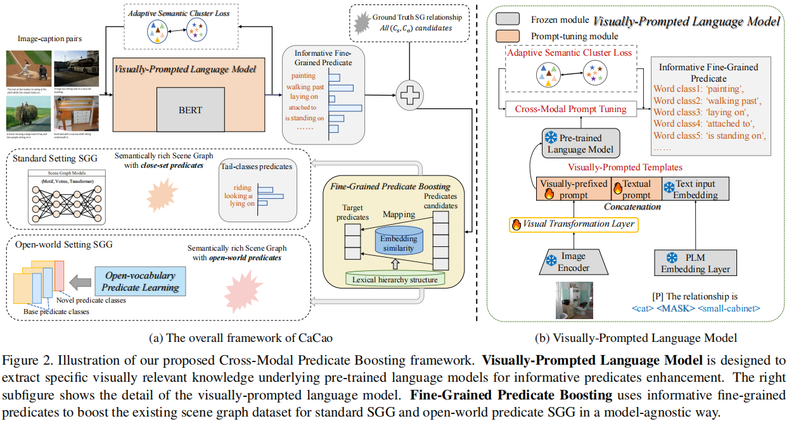
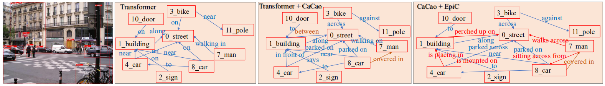
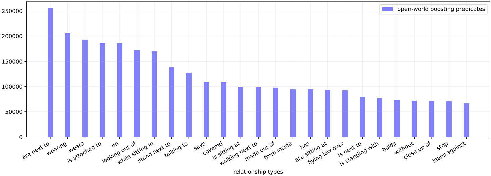

# CaCao
This is the official repository for the paper "Visually-Prompted Language Model for Fine-Grained Scene Graph Generation in an Open World" (Accepted by ICCV 2023)

# Complete code for CaCao and boosted SGG
Here we provide sample code for CaCao boosting SGG dataset in standard setting and open-world setting.
# Enhanced fine-grained predicates for VG
Download the enhanced dataset for VG training, you can use this [Google drive link](https://drive.google.com/drive/folders/1WOeumjptstD7nZQJgkJiqbQo9A_05gkh?usp=sharing).
## Running Script Tutorial
```bash
python adaptive_cluster.py # obtain initialized clusters for CaCao
python fine_grained_mapping.py # establish the mapping from open-world boosted data to target predicates for enhancement
```
```bash
python cross_modal_tuning.py # obtain cross-modal prompt tuning models for better predicate boosting
python fine_grained_predicate_boosting.py # enhance the existing SGG dataset with our CaCao model in <pre_trained_visually_prompted_model>
```
## Enhancement Retrain for SGG
	bash train_motif_expand.sh # expand SGG with motif models
	bash train_vctree_expand.sh # expand SGG with vctree models
	bash train_trans_expand.sh # expand SGG with transformer models
  
	# test for CaCao enhanced models
	bash test_expand.sh
## Open-World Predicate SGG Generalization
	# Backbone w/o Epic 
	bash train.sh TRANSGLOVE_novel
	# Epic (+CaCao)
	bash train.sh PROMPT_novel
# Quantitative Analysis

# Qualitative Analysis


## Predicate Boosting

## Predicate Prediction Distribution


## Acknowledgement
The SGG part code is implemented based on [Scene-Graph-Benchmark.pytorch](https://github.com/KaihuaTang/Scene-Graph-Benchmark.pytorch), [FGPL](https://github.com/XinyuLyu/FGPL), and [SSRCNN(One-Stage)](https://github.com/MCGNJU/Structured-Sparse-RCNN). Thanks for their great works! 
## 📜 Citation
If you find this work useful for your research, please cite our paper and star our git repo:
```bibtex
@inproceedings{yu2023visually,
  title={Visually-Prompted Language Model for Fine-Grained Scene Graph Generation in an Open World},
  author={Yu, Qifan and Li, Juncheng and Wu, Yu and Tang, Siliang and Ji, Wei and Zhuang, Yueting},
  booktitle={Proceedings of the IEEE/CVF International Conference on Computer Vision},
  year={2023}
}
```
