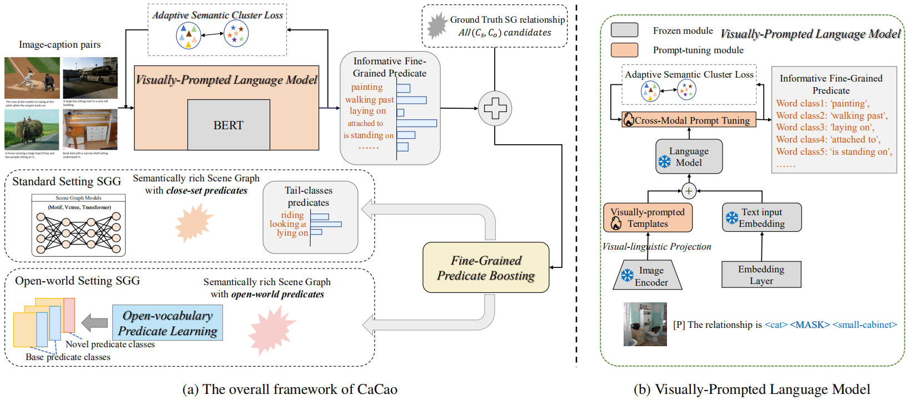

# CaCao
This is the official repository for the paper "Visually-Prompted Language Model for Fine-Grained Scene Graph Generation in an Open World"

# Complete code for CaCao and boosted SGG
Coming soon...
# Visualization

